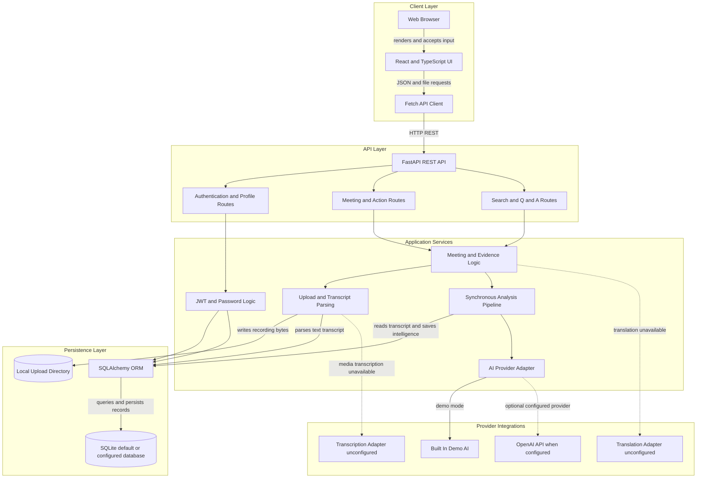
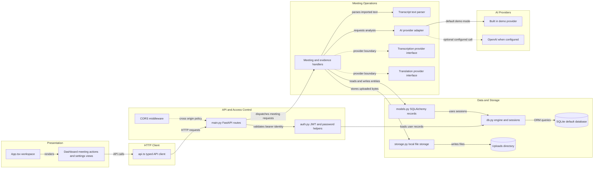

# Architecture Diagram

MeetMind AI is a browser-based meeting intelligence workspace backed by a FastAPI service. The diagrams below show the implemented request, processing, persistence, and provider boundaries; optional or unconfigured integrations are identified explicitly.

## Application Architecture

<!-- mermaid-checked: no \n, no em-dash/en-dash, no {} in labels, subgraphs are id["label"], arrows are -->|"label"|, all subgraphs closed by end, ids unique -->

### Technology Stack Summary

| Layer | Technology | Version | Purpose |
|---|---|---|---|
| Client | React, React DOM | `latest` in manifest | Responsive meeting workspace and views |
| Client | TypeScript | `latest` in manifest | Typed UI and API client |
| Client tooling | Vite | `latest` in manifest | Development server and production build |
| API | FastAPI | 0.115.6 | HTTP API, request validation, and OpenAPI |
| API | Pydantic | 2.10.4 | Request and response data validation |
| Application | Python | Not pinned in project manifests | API routes, authentication, meeting operations |
| Persistence | SQLAlchemy | 2.0.36 | ORM models, sessions, and database access |
| Persistence | SQLite by default | Runtime provided | Local relational persistence; `DATABASE_URL` can select another SQLAlchemy database |
| Persistence | Alembic | 1.14.0 | Migration files are present; startup currently initializes the schema with SQLAlchemy |
| Authentication | PyJWT and Passlib | 2.10.1 and 1.7.4 | Signed JWTs and PBKDF2-SHA256 password hashing |
| AI | OpenAI Python SDK | 1.59.7 | Optional LLM analysis when provider and credentials are configured |
| File handling | Local filesystem | Runtime provided | Uploaded meeting media and transcript files |

### Data Storage & External Services

SQLAlchemy persists users, meetings, transcripts, recordings metadata, processing stages, decisions, actions, risks, questions, and related records in SQLite by default. The connection can be changed with `DATABASE_URL`; uploaded file bytes are stored on the local filesystem under the backend uploads directory. AI analysis uses the built-in demo provider by default and can call OpenAI when configured. Transcription and translation interfaces exist but currently have no configured provider. No cache, message broker, object-storage service, or background-worker service is implemented.

### Key Architectural Decisions

- The React client communicates with the FastAPI backend over an HTTP JSON API; file uploads use multipart form data.
- Authentication and owner-scoped access are enforced in the API using JWT bearer tokens and SQLAlchemy-backed user and meeting records.
- Analysis runs synchronously in the API request. Processing-stage records track status and retries, but they are not a background job queue.

## Component Relationships

<!-- mermaid-checked: no \n, no em-dash/en-dash, no {} in labels, subgraphs are id["label"], arrows are -->|"label"|, all subgraphs closed by end, ids unique -->

### Component Inventory

| Component | Layer | Type | Responsibility |
|---|---|---|---|
| `App.tsx` | Presentation | React application | Owns workspace state and renders application views |
| Workspace views | Presentation | React components in `App.tsx` | Present dashboard, meeting intelligence, actions, search, settings, and supporting screens |
| `api.ts` | HTTP client | Typed fetch client | Calls API endpoints, attaches bearer tokens, and handles JSON and file transfers |
| `main.py` | API and access control | FastAPI application and route handlers | Exposes health, authentication, meeting, upload, processing, search, Q&A, action, and account endpoints |
| CORS middleware | API and access control | FastAPI middleware | Allows configured and local frontend origins |
| `auth.py` | API and access control | Authentication module | Hashes passwords, issues and verifies JWTs, and resolves the current user |
| Meeting handlers | Meeting operations | API route logic in `main.py` | Enforce meeting access and coordinate transcript, intelligence, action, search, and export operations |
| `parser.py` | Meeting operations | Transcript parser | Converts supported plain text, SRT, and VTT content into transcript segments |
| `ai/provider.py` | Meeting operations | Provider abstraction | Selects demo, configured OpenAI, or explicit unconfigured AI behavior |
| `transcription/provider.py` | Meeting operations | Provider interface | Defines media transcription boundary; no concrete provider is configured |
| `translation/provider.py` | Meeting operations | Provider interface | Detects supported writing systems and defines translation boundary; no concrete translator is configured |
| `db.py` | Data and storage | SQLAlchemy engine and session factory | Configures the database URL and provides request-scoped sessions |
| `models.py` | Data and storage | ORM models | Defines user, meeting, transcript, recording, action, decision, risk, question, and processing records |
| SQLite database | Data and storage | Relational database | Stores application records by default; alternate SQLAlchemy URLs are configurable |
| `storage.py` | Data and storage | Filesystem storage helper | Writes uploaded meeting files into meeting-specific local directories |
| Built-in demo provider | AI providers | Local provider implementation | Supplies demo analysis and evidence-safe fallback answers without external credentials |
| OpenAI provider | AI providers | External AI adapter | Performs analysis and Q&A when `AI_PROVIDER` and `OPENAI_API_KEY` are configured |
